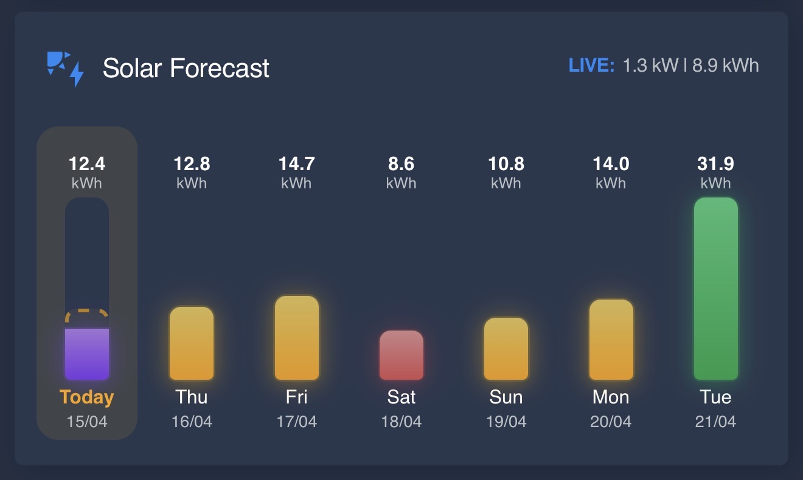
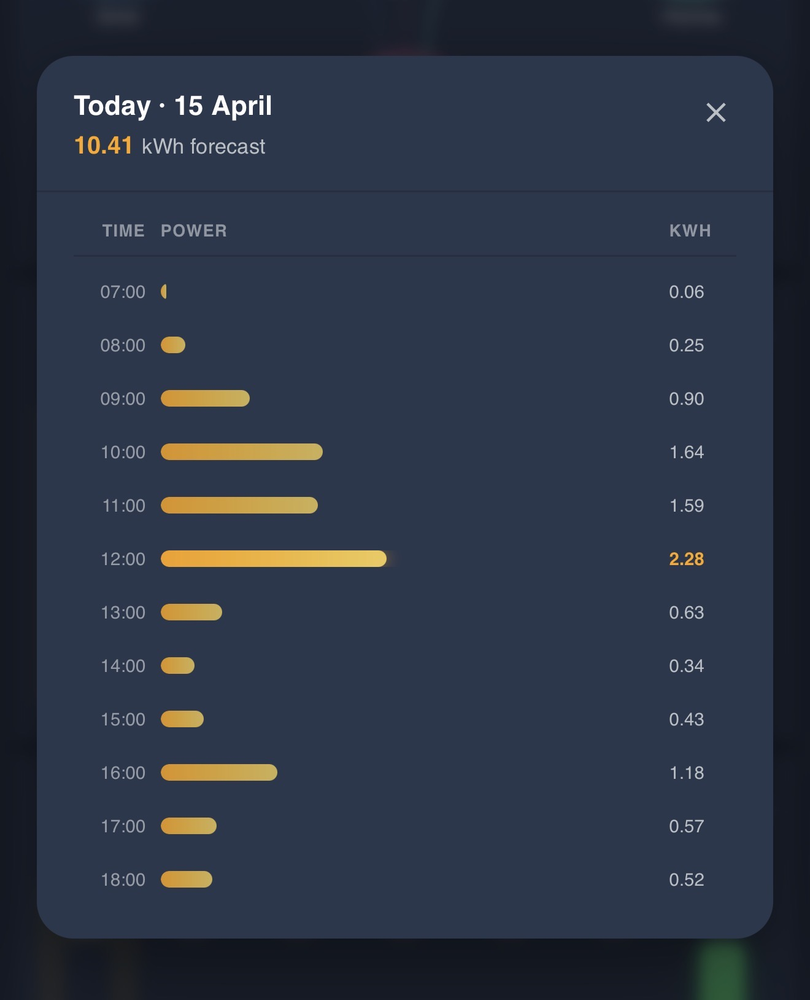

# Solar Forecast Card

A Home Assistant Lovelace custom card for displaying solar energy forecast data supplied by any forcasting integration, but with simple set up for use with the Volcast integration by selecting the Volcast device to allow the card to auto map entities. 

## Screenshots





## Installation

### HACS (Recommended)
#### Install via HACS

Click below to add this repository to HACS:

[](https://my.home-assistant.io/redirect/hacs_repository/?owner=AshGSmith&repository=solar-forecast-card)

#### HACS Custom Repository Manual Steps
1. Open HACS in your Home Assistant instance.
2. Click on the **⋮** button on the top right and select **Custom repositories***
3. Enter the below in the **Repository** field
```url
https://github.com/AshGSmith/solar-forecast-card
```
4. Select **Dashboard** as the **Type** and Add.
5. Search for **Solar Forecast Card** and install it.
6. Reload your browser.

### Manual

1. Download `solar-forecast-card.js` from the [latest release](../../releases/latest).
2. Copy it to your `config/www/` folder (e.g. `config/www/solar-forecast-card.js`).
3. In Home Assistant, go to **Settings → Dashboards → Resources** and add:
   - URL: `/local/solar-forecast-card.js`
   - Resource type: **JavaScript module**
4. Reload your browser.

## Configuration

Add the card to a dashboard using the card picker, or add it manually in YAML:

```yaml
type: custom:solar-forecast-card
title: Solar Forecast          # optional — defaults to "Solar Forecast"
icon: mdi:solar-power          # optional — defaults to mdi:solar-power
show_header: true              # optional — defaults to true
device_id: <your_device_id>    # optional — auto-detects forecast entities
forecast_entities:
  - sensor.forecast_today
  - sensor.forecast_tomorrow
  - sensor.forecast_day_3
  - sensor.forecast_day_4
  - sensor.forecast_day_5
  - sensor.forecast_day_6
  - sensor.forecast_day_7
live_power_entity: sensor.solar_power_now
today_actual_entity: sensor.solar_energy_today
inverter_max_kw: 5.0
solar_max_kwp: 4.2
date_format: DD/MM
time_format: 24h
low_threshold: 10
high_threshold: 30
```

### Options

#### Card

| Option | Type | Required | Default | Description |
|--------|------|----------|---------|-------------|
| `type` | string | yes | — | Must be `custom:solar-forecast-card` |
| `title` | string | no | `Solar Forecast` | Text displayed in the card header |
| `icon` | string | no | `mdi:solar-power` | MDI icon shown to the left of the title (e.g. `mdi:solar-power-variant`) |
| `show_header` | boolean | no | `true` | Show or hide the card header, including the title and live data badge |

#### Device & Entities

| Option | Type | Required | Default | Description |
|--------|------|----------|---------|-------------|
| `device_id` | string | no | — | Home Assistant device ID. When set, forecast entities and the actual generation sensor are auto-detected from the device. Manual entity selections override auto-detected values |
| `forecast_entities` | list | yes | — | Exactly 7 sensor entity IDs representing Day 1 (today) through Day 7. Each sensor must expose a numeric state (kWh) and, for hourly popup support, an `hours` attribute |

#### Live Data

| Option | Type | Required | Default | Description |
|--------|------|----------|---------|-------------|
| `live_power_entity` | string | no | — | Sensor reporting current solar output. Accepts W or kW (detected via `unit_of_measurement`). Displayed in the header as `LIVE: X W` or `X.X kW` |
| `today_actual_entity` | string | no | — | Sensor reporting total energy generated today (kWh). Shown in the header alongside live power, and used to render the actual generation bar on today's column |

#### System

| Option | Type | Required | Default | Description |
|--------|------|----------|---------|-------------|
| `inverter_max_kw` | number | no | — | Inverter maximum continuous output in kW. Used as the ceiling for hourly popup bar scaling when the solar array is at or above this value |
| `solar_max_kwp` | number | no | — | Solar array peak capacity in kWp. Used as the hourly graph ceiling when smaller than `inverter_max_kw`. If neither system value is set, bars scale relative to the day's peak hour |

#### Display

| Option | Type | Required | Default | Description |
|--------|------|----------|---------|-------------|
| `date_format` | string | no | `DD/MM` | Date format for day column labels. `DD/MM` (e.g. 15/04) or `MM/DD` (e.g. 04/15) |
| `time_format` | string | no | `24h` | Time format used in the hourly forecast popup. `24h` (e.g. `17:00`) or `12h` (e.g. `5pm`) |

#### Colour Thresholds

Bar colours change based on each day's forecast total. When neither threshold is set all bars use the default amber colour.

| Option | Type | Required | Default | Description |
|--------|------|----------|---------|-------------|
| `low_threshold` | number | no | — | Days forecast below this value (kWh) are shown in a soft red/coral colour |
| `high_threshold` | number | no | — | Days forecast above this value (kWh) are shown in green |

## License

MIT
